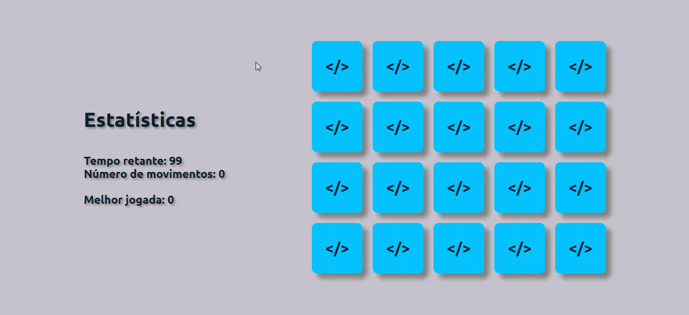

  # Memory Game

  Test your memory ability with memory game

  

   [Demo](#demo) •
   [About](#about-project) •
   [Technologies](#technologies) •
   [Getting started](#getting-started) •
   [License](#license)

  

<h2 id="demo">📷 Demo</h2>

  

  <h3>

   🕹 [TEST GAME](https://nicolasduma.github.io/jogo-da-memoria) 🕹

  <h3>

<h2 id="about-project">ℹ About the project</h2>

A special game for web developers, because here you can play the famous memory game with some of the best technologies on the market.

<h2 id="technologies">🚀 Technologies</h2>

-  HTML
-  CSS
-  JavaScript
